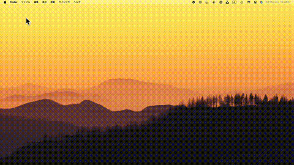

# mcenter

[](https://opensource.org/licenses/MIT)
[](https://www.apple.com/macos/)
[](https://www.raycast.com/)

A Raycast command script that moves the mouse cursor to the center of a specified display

## Overview

This tool provides a function to quickly move the cursor to the center of a specified display when you lose track of your mouse cursor in a multi-display environment. It can be easily called from Raycast, and by setting a shortcut key, you can access it even more quickly.



> **Note:** This script was initially generated with AI assistance and then refined and improved by the author.

## Features

- Support for multiple displays
- Ability to specify display number (default is 1)
- One-click execution from Raycast
- Shortcut key configuration available

## Requirements

- macOS
- [Raycast](https://www.raycast.com/)
- Swift (only required for compilation)

## Installation

1. Clone or download this repository
   ```bash
   git clone https://github.com/oishi/mcenter.git
   ```

2. First, run the `.sh` file to verify it works
   ```bash
   ./mcenter.sh
   ```
   On the first run, `mcenter.swift` will be automatically compiled and a `mcenter` executable file will be generated.

3. After confirming it works, copy both the `mcenter.sh` and the generated `mcenter` executable to your Raycast scripts directory
   ```bash
   cp mcenter.sh mcenter ~/.raycast/scripts/
   ```
   
   > **Note:** The destination path may vary depending on your environment. Make sure to specify the directory that is correctly configured as the command scripts directory in your Raycast settings.

4. Open Raycast and run mcenter in the command palette

## Configuration

You can customize the default display index by modifying the `DEFAULT_DISPLAY_INDEX` variable in the `mcenter.sh` script:

```bash
# Default display index (can be modified for different environments)
DEFAULT_DISPLAY_INDEX=1
```

Change this value to match your preferred default display. This is especially useful when you have a consistent multi-display setup and want to target a specific display by default.

## How It Works

The tool uses macOS's CoreGraphics framework to retrieve a list of active displays and calculate the center coordinates of the specified display. It then uses the `CGWarpMouseCursorPosition` function to move the mouse cursor to those center coordinates.

## License

This project is licensed under the MIT License. See the [LICENSE](LICENSE) file for details.

## Contributing

Please report bugs or suggest features through GitHub Issues. Pull requests are also welcome.

## Author

- [oishi](https://raycast.com/oishi)
